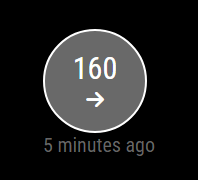
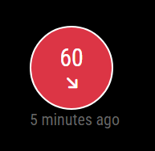
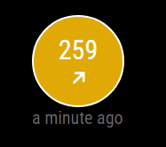

# MMM-Dexcom
Magic Mirror module for Dexcom G7 Readings

## Summary
This module provides a lightweight and dependency free option to view Dexcom G7 readings. It makes use of the Follow applicaiton, so you must first configure a Follow account before proceeding.

The thresholds for High and Low are configurable and will display Yellow and Red accordingly. 

The relative time (i.e. 2 minutes ago) is updated every 30 seconds in between the regular refreshes. By default, new values will be fetched every 5 minutes. 
## Sample Config
```json
{
    "module": "MMM-Dexcom",
    "position": "top_left",
    "config": {
        "updateSecs": 300, // Default is refresh every 5 minutes
        "username": "",  // Set to your Dexcom username
        "password": "", // Password for your Dexcom account
        "units": "mg",  // or mmol
        "lowlimit": 70,  // must be relevant to the units
        "highlimit": 200,  // must be relevant to the units
    }
}
```
## Screenshots
#### Normal Value with Flat Trend

#### Low Value with Downward Trend

#### High Value with Upward Trend

